# TraceHawk: Network Forensics & Threat Detection Lab

## Overview

TraceHawk is a SOC-style cybersecurity project focused on detecting network-based attacks using Zeek. The project simulates an SSH brute force attack in a controlled lab environment and demonstrates how suspicious traffic can be captured, analyzed, detected, investigated, and reported. The workflow followed in this project reflects real-world SOC operations: Attack -> Capture -> Analyze -> Detect -> Investigate -> Report.

## Objectives

- Capture network traffic using tcpdump
- Analyze traffic using Zeek logs such as conn.log and ssh.log
- Detect SSH brute force attack patterns
- Identify attacker IP without prior assumption
- Validate findings using Wireshark packet analysis
- Implement Python-based detection logic
- Document findings in a SOC-style incident report

## Lab Architecture

| Machine | Role | Tools / Services |
|---|---|---|
| Kali Linux | Attacker | Hydra, Nmap |
| Windows 11 | Target System | OpenSSH Server |
| Ubuntu | Monitoring Node | Zeek, tcpdump, Wireshark |

## Architecture Diagram

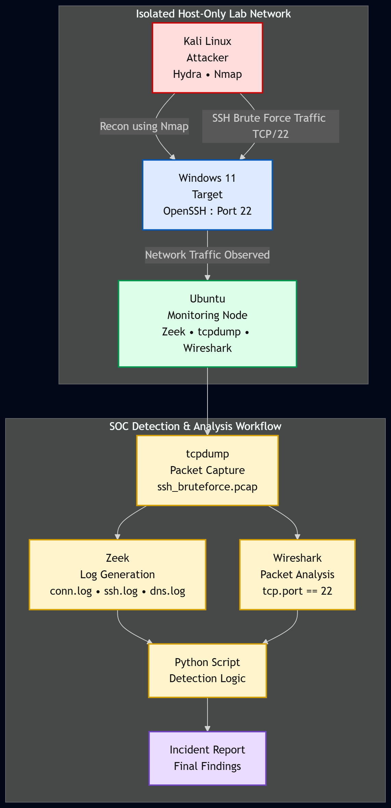

## Attack Scenario

An SSH brute force attack was simulated using Hydra from Kali Linux against the Windows 11 target system.

```bash
hydra -l testuser -P /usr/share/wordlists/rockyou.txt ssh://192.168.206.133 -t 4 -V
```

## Data Collection

Network traffic was captured on the Ubuntu monitoring system using tcpdump.

```bash
sudo tcpdump -i ens34 -nn -w ssh_bruteforce.pcap
```

The captured PCAP file was processed using Zeek to generate structured network logs.

```bash
zeek -r ssh_bruteforce.pcap
```

## Zeek Logs Used

| Log File | Purpose |
|---|---|
| conn.log | Connection-level network activity |
| ssh.log | SSH session visibility |
| dns.log | DNS query activity |
| dhcp.log | DHCP-related activity |
| weird.log | Protocol anomalies |
| packet_filter.log | Packet filtering information |
| reporter.log | Zeek runtime messages |

## Detection Methodology

SSH brute force activity was detected using frequency-based analysis of Zeek connection logs. The investigation focused on repeated connection attempts toward TCP port 22.

```bash
cat conn.log | zeek-cut id.orig_h id.resp_p | grep 22 | sort | uniq -c | sort -nr
```

This command identifies the source IP generating the highest number of SSH connection attempts. The suspected attacker was not assumed based on the lab setup; it was identified through log evidence and traffic behavior.

## Key Findings

- A high number of SSH attempts were observed from a single source IP
- The target system was repeatedly accessed on TCP port 22
- The traffic pattern showed repeated short-duration connections
- The behavior was consistent with automated SSH brute force activity
- The attacker IP was identified through Zeek log analysis instead of prior assumption
- Wireshark was used to validate the packet-level behavior

## Screenshots

### Network Connectivity

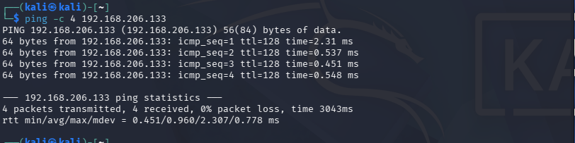

### SSH Service Discovery

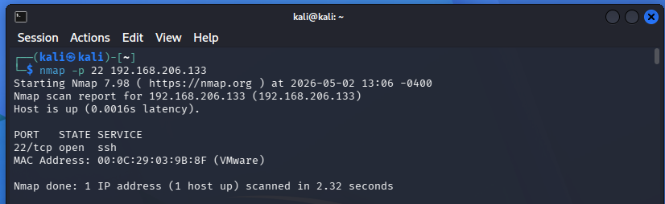

### Packet Capture Started

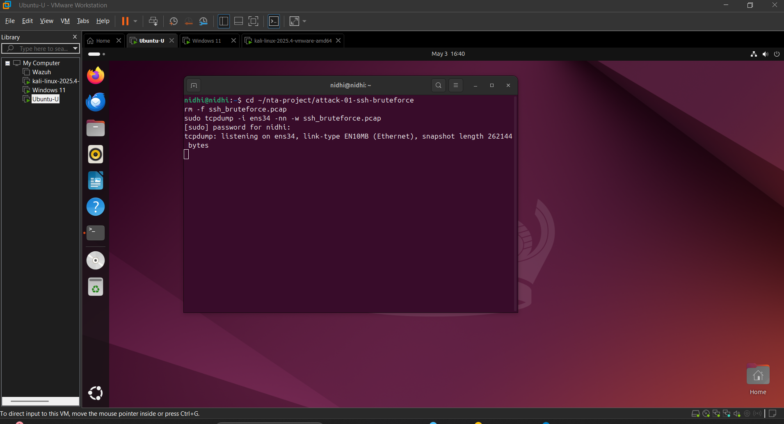

### Brute Force Attack Execution

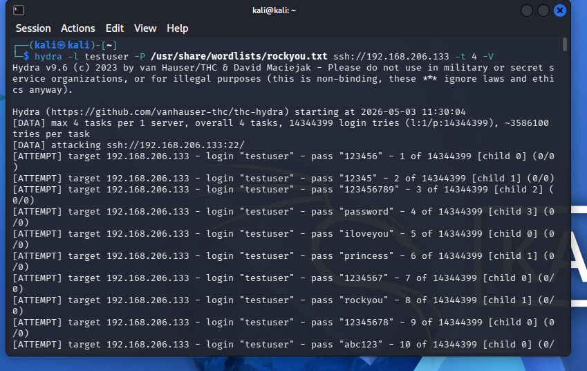

### Packet Capture Stopped

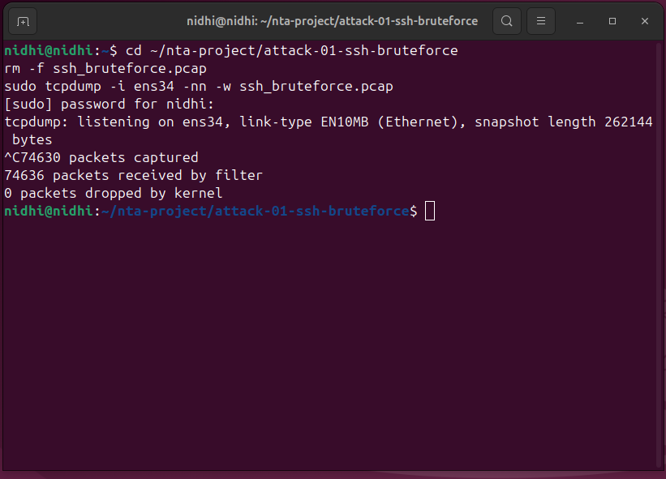

### Zeek Logs Generated

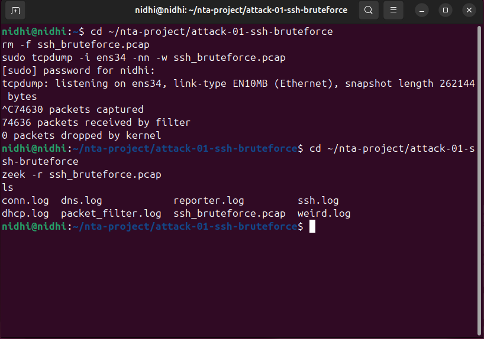

### Attacker IP Identification

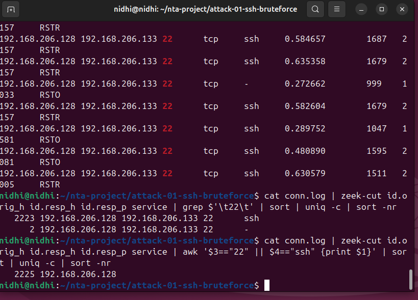

### Connection Log Analysis

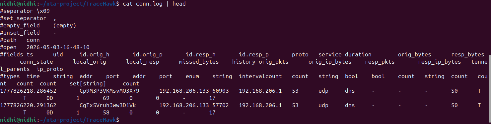

### Wireshark SSH Traffic Analysis

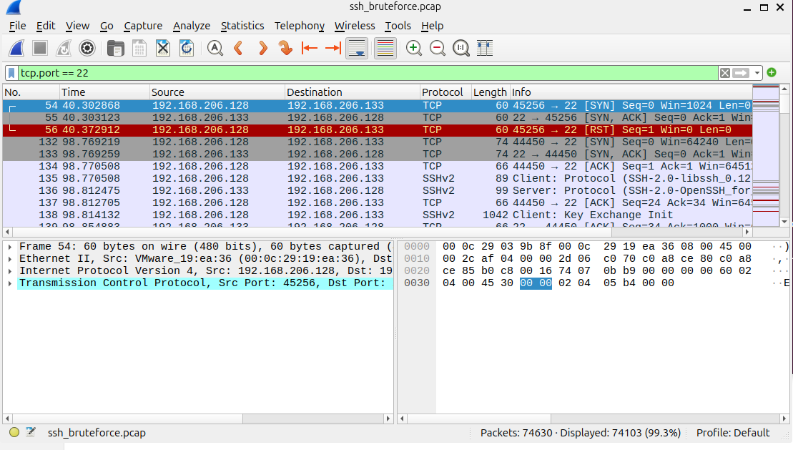

### Python Detection Output

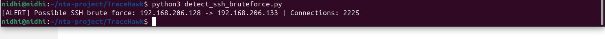

## Project Structure

```text
TraceHawk/
├── README.md
├── LICENSE
├── .gitignore
├── architecture/
│   └── network_architecture.png
├── setup/
│   └── setup.md
├── analysis/
│   └── brute_force_analysis.md
├── attacks/
│   └── ssh_bruteforce.md
├── incident-reports/
│   └── ssh_bruteforce_report.md
├── pcaps/
│   └── ssh_bruteforce.pcap
├── zeek-logs/
│   └── ssh-bruteforce/
│       ├── conn.log
│       ├── ssh.log
│       ├── dns.log
│       ├── dhcp.log
│       ├── packet_filter.log
│       ├── reporter.log
│       └── weird.log
├── detection-scripts/
│   └── detect_ssh_bruteforce.py
└── screenshots/
    └── ssh-bruteforce/
        ├── kali_to_windows_ping.png
        ├── nmap_ssh_port_open.png
        ├── tcpdump_capture_started.png
        ├── hydra_bruteforce_attack.png
        ├── tcpdump_capture_stopped.png
        ├── zeek_logs_generated.png
        ├── attacker_ip_identification.png
        ├── conn_log_analysis.png
        ├── wireshark_ssh_filter.png
        └── python_detection_alert.png
```

## Skills Demonstrated

- Network Traffic Analysis
- Zeek Log Analysis
- PCAP Analysis
- Wireshark Packet Inspection
- SSH Brute Force Detection
- SOC Investigation Workflow
- Python-Based Detection Logic
- Incident Documentation

## Disclaimer

This project was created for educational and portfolio purposes only. All testing was performed in a controlled lab environment.
